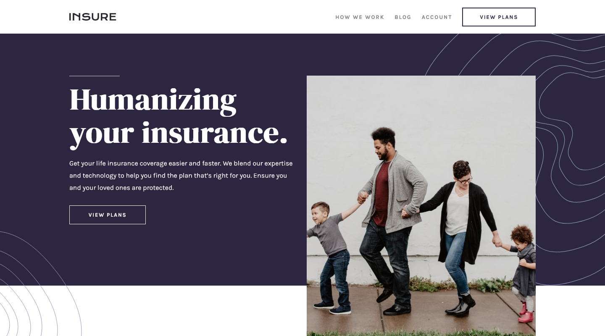

# Frontend Mentor - Insure landing page solution

This is a solution to the [Insure landing page challenge on Frontend Mentor](https://www.frontendmentor.io/challenges/insure-landing-page-uTU68JV8). Frontend Mentor challenges help you improve your coding skills by building realistic projects.

## Table of contents

- [Frontend Mentor - Insure landing page solution](#frontend-mentor---insure-landing-page-solution)
  - [Table of contents](#table-of-contents)
  - [Overview](#overview)
    - [The challenge](#the-challenge)
    - [Screenshot](#screenshot)
    - [Links](#links)
  - [My process](#my-process)
    - [Built with](#built-with)
    - [What I learned](#what-i-learned)
    - [Useful resources](#useful-resources)
  - [Author](#author)
  - [Acknowledgments](#acknowledgments)

**Note: Delete this note and update the table of contents based on what sections you keep.**

## Overview

### The challenge

Users should be able to:

- View the optimal layout for the site depending on their device's screen size
- See hover states for all interactive elements on the page

### Screenshot

### Links

- Solution URL: [Add solution URL here](https://github.com/Nghuynh07/insure__landing__page)
- Live Site URL: [Add live site URL here](https://strong-shortbread-95623c.netlify.app/)

## My process

### Built with

- Semantic HTML5 markup
- CSS custom properties
- CSS Grid
- Mobile-first workflow

### What I learned

- I learned about prefers-reduced-motion and tested on my computer by setting window ease of access animation to off.

### Useful resources

- [MDN Web Doc](https://developer.mozilla.org/en-US/docs/Web/CSS/@media/prefers-reduced-motion)
- [Web Dev](https://web.dev/prefers-reduced-motion/)
- [The 62.5% trick - NOT TO DO](https://www.joshwcomeau.com/css/surprising-truth-about-pixels-and-accessibility/#the-625-trick)

## Author

- Website - [Huynh Nguyen](https://huynhtn.com/)
- Frontend Mentor - [@Nghuynh07](https://www.frontendmentor.io/profile/Nghuynh07)
- Twitter - [@huyniewin](https://twitter.com/huyniewin)

## Acknowledgments

Thank you @vanzasetia from FM for his comment on my previous project regarding prefers-reduced-motion. This is important for accessibility for motion triggered vestibular spectrum disorder individual. I'll be adding this concept into all my projects from now on. I also learned NOT to set font size to 62.5%. An article above regarding not setting the html font-size to 62.5% by Josh W Comeau.
